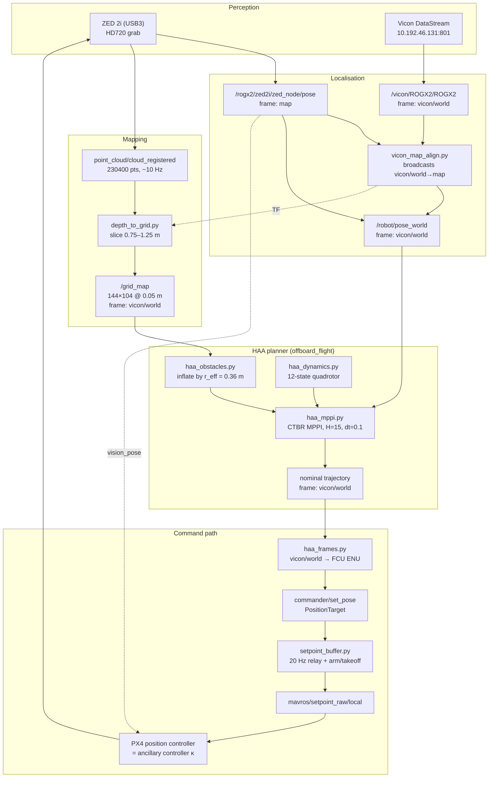

# ROG-X onboard autonomy — current framework

HAA (High-Assurance Autonomy) half of the DeSimplex architecture, running onboard
the Jetson Xavier NX. Perception → grid → MPPI → PX4.

Every number below was measured on this vehicle, not taken from a datasheet.
Where something is unverified it says so.

---

## 1. Pipeline



The loop closes twice: PX4 flies the vehicle, which moves the ZED, which feeds
both the map and (as `vision_pose`) EKF2 itself.

---

## 2. Frames — the part that bites

Three frames are live at once. Confusing them is the single most likely way to
fly into a wall.

| Frame | Origin | Who publishes | Who consumes |
|---|---|---|---|
| `vicon/world` | Vicon room origin, fixed | `vicon_bridge` | `/grid_map`, `/robot/pose_world`, **the planner** |
| ZED `map` | Wherever the ZED powered up | `zed_wrapper` | EKF2 via `vision_pose` |
| FCU local ENU (`odom`) | Wherever EKF2 initialised | `mavros` | **`setpoint_raw/local`** |

`mavros_rogx.launch` remaps `mavros/vision_pose/pose ← zed2i/zed_node/pose`, so
**EKF2 is driven by the ZED, not by Vicon** (the mocap remap is commented out).
The FCU frame is therefore anchored to the ZED's power-up pose, which has nothing
to do with the Vicon origin.

Measured offset on 2026-07-30:

```
world→FCU:  t = [2.853, -0.585, 0.132] m,  dyaw = -6.6°
            residual 0.006 m,  prediction error 0.005 m
            without the conversion: 2.916 m of error
```

`haa_frames.WorldToFcu` estimates this continuously from the matched pair
(`/robot/pose_world`, `mavros/local_position/pose`) — both describe the same
body, so the transform falls out directly. It is re-estimated rather than
calibrated once, because EKF2 drifts against Vicon over a flight.

**Do not substitute the TF `vicon/world→map` for this.** Checked: x/y/yaw agree
within 2 cm / 0.4°, but z does not — the TF chain gives −0.129 (via `map`) or
+0.062 (via `odom`) where the direct measurement gives +0.132, and the chain is
not even self-consistent in z. At a 1 m hover that is a 7–26 cm altitude error.

**Everything upstream of the setpoint is in `vicon/world`** — state, grid, goal,
plan, all viz topics. The conversion happens once, in `publish_setpoint()`. If
the alignment is not established or is stale, no setpoint is published at all.

---

## 3. Perception → grid

### ZED 2i

| Property | Value | How known |
|---|---|---|
| Grab resolution | HD720 (`resolution: 2`) | `common.yaml` |
| **Published depth** | **640×360**, `32FC1`, metres | measured |
| Depth topic | `depth/depth_registered` | `zed_nodelet` source |
| Intrinsics | `fx = fy = 261.67`, `cx = 327.44`, `cy = 176.05` | `camera_info` |
| **FOV** | **101.5° H × 69.0° V** (109° diag) | computed from `camera_info` |
| Distortion | all zero (rectified) | `camera_info` |
| Point cloud | 230,400 pts, **~10 Hz** | measured |

Nominal ZED 2i spec is 110° H; 101.5° is what survives rectification. If you
match SITL to reality, set `zed_camera.sdf` `horizontal_fov` to 1.771 rad.

`cx`/`cy` are ~7 px and ~4 px off centre. Irrelevant if you feed the depth image
straight to a network; **read them from `camera_info`** if you reproject to 3D.

### depth_to_grid.py

Consumes the **point cloud**, not the depth image.

```
grid:      144 × 104 cells @ 0.05 m   →  x[-3.6, 3.6], y[-2.6, 2.6] m
frame:     vicon/world
rate:      ~15 Hz  (60–100 ms/frame — a real CPU cost, see §7)
values:    0 free / 100 occupied / -1 unknown
```

Obstacles are a **horizontal slab**, floor-relative:

```python
obs = (zc >= floor + z_min) & (zc <= floor + z_max)   # depth_to_grid.py:162
# obstacle_min_height = 0.75, obstacle_max_height = 1.25, floor_z = 0.0
```

Points outside 0.75–1.25 m are ignored entirely — floor, ceiling, low and high
objects all vanish. Free-space carving is restricted to the same band
(`:179`), so it is consistent.

The band is **fixed to the floor, not to the vehicle**. `auto_floor=false` and
`floor_z=0.0` in the world frame, so it stays at 0.75–1.25 m however high you
fly. Centred on 1.0 m, which is why `takeoff_height` and `z_hold` are both 1.0.

> **Start the ZED with the vehicle on the ground** so z=0 is the floor.
> Corollary: mapping from the ground is nearly useless — at ZED height ≈0.13 m
> almost nothing falls in the band. Measured on the ground: **60.1% unknown**,
> 31.1% free, 8.8% occupied. Map *after* reaching hover.

---

## 4. HAA planner

Package: `~/catkin_ws/src/offboard_flight/scripts/`

| File | Role |
|---|---|
| `haa_dynamics.py` | quadrotor models (3 variants) |
| `haa_obstacles.py` | grid → inflated obstacle set |
| `haa_mppi.py` | MPPI solver |
| `haa_frames.py` | vicon/world ↔ FCU ENU alignment |
| `haa_planner_node.py` | ROS node wiring it together |

### Inputs

| Topic | Type | Frame | Purpose |
|---|---|---|---|
| `/robot/pose_world` | `PoseStamped` | vicon/world | **planner state** |
| `/rogx2/mavros/local_position/pose` | `PoseStamped` | FCU ENU | alignment only |
| `mavros/local_position/velocity_local` | `TwistStamped` | FCU ENU | state velocity |
| `mavros/imu/data` | `Imu` | body | body rates |
| `/grid_map` | `OccupancyGrid` | vicon/world | obstacles |
| `/move_base_simple/goal` | `PoseStamped` | vicon/world | goal (or `~goal_x/y`) |

### Outputs

| Topic | Type | Notes |
|---|---|---|
| `commander/set_pose` | `PositionTarget` | **FCU ENU**, the only converted quantity |
| `~nominal_path` | `Path` | chosen plan, vicon/world |
| `~rollouts` | `MarkerArray` | surviving samples (thin blue) + nominal (thick orange) |
| `~goal_marker` | `Marker` | goal sphere, radius = `goal_tol` |
| `~status` | `String` | `valid=n/K cost=… solve=…ms | world→FCU: …` |

### Dynamics — CTBR, following PA-MPPI

```
state  x = [px py pz  vx vy vz  roll pitch yaw  wx wy wz]     (12)
input  u = [c  wx_cmd wy_cmd wz_cmd]                          (4)

p'   = p + dt·v
v'   = v + dt·(c/m · R(rpy)·e3 − g·e3)
rpy' = rpy + dt·rpy_dot(rpy, ω)
ω'   = ω_cmd + (ω − ω_cmd)·exp(−dt/τ)      τ = 0.03 s
```

The rate lag uses the **exact** first-order solution, not an Euler step — a
realistic τ=0.03 s is far shorter than the 0.1 s planner step and Euler would
diverge there.

**Mass is used** (`m = 3.245 kg`, measured; `rogx.sdf` sums to 3.1928 kg).
**Inertia is NOT used.** Commanding body rates never forms a moment, and writing
the rate loop as `M = J·k(ω_cmd−ω) + ω×Jω` makes J cancel exactly. Verified:
multiplying J by 7 changes the trajectory by `0.00e+00`. `rogx.sdf`'s
`ixx 0.0218 / iyy 0.0242 / izz 0.0349` (off-diagonals included) is loaded as
`ROGX_INERTIA` and used only by the unused `[f, M]` model.

Two other models exist in `haa_dynamics.py`:
- `QuadrotorDynamics` — raw `[f, Mx, My, Mz]`, paper eq 64–67. **Unusable for
  planning**: attitude integrates open-loop, so over a 4 s horizon only 0.9% of
  samples stay inside the tilt limit and 0.0% inside the velocity limit (peak
  roll 22 rad, peak speed 53 m/s). Kept because it is the honest physics.
- `AttitudeStabilizedQuadrotor` — input is desired acceleration, inner attitude
  P-loop generates the moments. Selectable with `~model:=accel`.

### Obstacle inflation

DeSimplex eq 79: `r_eff = r_Q + r_track + r_perc = 0.31 + 0.05 + 0.0 = 0.36 m`

`r_track` is not arbitrary padding — it is the robust invariant set **Z** of
eq 14 (`Ō = O ⊕ Z`). Because PX4 is the ancillary controller κ, Z is PX4's
position-hold error. Avoiding the inflated set with the *nominal* trajectory is
what guarantees the *true* trajectory avoids the real obstacles. **Measure PX4's
hold error in flight and set `~r_track` from it.**

Unknown cells count as obstacles (`unknown_is_obstacle=true`) — same as PA-MPPI,
which states the large penalty makes the vehicle "refrain from entering unknown
regions".

### Cost (DeSimplex eq 59 shape)

```
C = w_goal·Σ‖p−p_goal‖ + w_term·‖p_N−p_goal‖ + w_z·Σ(z−z_hold)²
    + w_vel·Σ‖v‖² + w_smooth·Σ‖ΔU/σ‖²
```
`10 / 100 / 50 / 0.5 / 1.0`. Smoothing is σ-normalised because thrust (N) and
rates (rad/s) differ by ~70× in scale.

Infeasible samples are **discarded**, not penalised — that discard is what makes
"all samples infeasible" the safety certificate of theorem 1. (PA-MPPI instead
weights a binary indicator; DeSimplex requires the discard.)

### Measured performance

| Config | solve | valid |
|---|---|---|
| K=128, H=15 (idle box) | 36 ms | 75.8% |
| K=256, H=15 (idle box) | 48 ms | 71.5% |
| **K=128, H=15 (grid + perception stack live)** | **150–165 ms** | 26–54/128 |

Budget at 10 Hz is 100 ms. **Currently over.** Cost is dominated by `H`, not `K`
— per-step numpy overhead is a fixed charge, so K=64→1024 only costs 48→120 ms
at H=20. Do not raise H: survival halves (71% → 36%) from H=15 to H=20 because
attitude random-walks further.

---

## 5. Tracking — PX4 does it

The planner emits **position setpoints**; PX4's internal position controller
tracks them. There is no custom tracker, by design.

```
haa_planner_node  →  commander/set_pose  →  setpoint_buffer.py
                                          →  mavros/setpoint_raw/local (20 Hz)
                                          →  PX4 position controller
```

`setpoint_buffer.py` is unchanged from the ANT-X original and does three jobs:
arms, climbs to `takeoff_height` at `takeoff_speed`, and **republishes the last
setpoint at 20 Hz forever**. That last job is the safety net — if the planner
dies or stalls, the vehicle holds position instead of dropping OFFBOARD.

In DeSimplex terms PX4 is the ancillary feedback controller **κ** of eq 6, and
the tube Z it induces is what `r_track` inflates obstacles by.

Relevant PX4 params (verified on the FCU):

| Param | Value | Meaning |
|---|---|---|
| `EKF2_AID_MASK` | 24 | vision position (8) + vision yaw (16) |
| `EKF2_HGT_MODE` | 2 | height reference = vision |
| `MPC_XY_VEL_MAX` | **0.5 m/s** | ⚠ planner defaults to 1.5 — see §7 |
| `COM_RCL_EXCEPT` | **0** | ⚠ no OFFBOARD exception for RC loss |
| `NAV_RCL_ACT` | 3 | RC loss → Land |

---

## 6. Startup sequence

ZED must be running **before** arming — it is EKF2's only position source. Never
restart it in flight. Mapping and planning start **after** hover, because the
grid's height band is useless from the ground.

```bash
# 0. once, from a terminal on the Jetson
GCS_IP=<your PC ip> ~/start_test_grid.sh vicon
#    roscore + mavros + zed + vicon + foxglove   (each in its own screen)
#    then stop the gridmap screen: it should start after takeoff
screen -S gridmap -X quit

# 1. arm + climb to 1.0 m + hold   (keep this terminal alive)
cd ~/catkin_ws/src/offboard_flight/scripts
ROS_NAMESPACE=rogx2 python setpoint_buffer.py

# 2. once hover is stable — start mapping
roslaunch zed_rtabmap_example zed_vicon_grid.launch start_vicon:=false open_rviz:=false

# 3. watch this the whole time; if it drops, take manual control
rostopic hz /rogx2/zed2i/zed_node/pose

# 4. planner (NOT yet flight-ready — see §7)
rosparam delete /rogx2/haa_planner_node     # stale params survive restarts!
ROS_NAMESPACE=rogx2 python3 haa_planner_node.py _num_samples:=128
```

Health check: `~/start_test_grid.sh check`. Foxglove: `ws://<jetson-ip>:8765`,
fixed frame `vicon/world`. Keep point clouds and images **off** in Foxglove —
they saturate the WiFi and the bridge logs `Send buffer limit reached`.

---

## 7. Open issues

1. **Solve time 150–165 ms vs a 100 ms budget.** Lower `~plan_rate` to 5 Hz, or
   `~num_samples` to 64, or move the rollout to CUDA (PyTorch 2.0.0+nv23.05 with
   CUDA 11.4 is installed and working; a conv forward pass measures 2.63 ms).
   PA-MPPI runs 17,500 samples at 50 Hz — on an A1000 GPU.

2. **`MPC_XY_VEL_MAX = 0.5` vs planner `vel_max = 1.5`.** The planner will
   produce trajectories PX4 cannot track, and the tracking error goes straight
   into the tube Z that `r_track = 0.05 m` is supposed to cover. Raise the PX4
   param or lower the planner — but they must agree.

3. **`COM_RCL_EXCEPT = 0` with `NAV_RCL_ACT = 3`.** OFFBOARD without RC triggers
   the RC-loss failsafe. Either keep the RC on (current approach — verified
   receiving, rssi 41) or set `COM_RCL_EXCEPT = 4`.

4. **No path to a goal in unmapped space.** `(2.5, 0.0)` is an unknown cell, so
   it reads as an obstacle and MPPI cannot route to it. DeSimplex HAA has no
   mechanism for this; PA-MPPI solves it with a perception cost — PoI alignment
   (+5.0), occupied-ray penalty (+2.0), **unknown-frontier reward (−4.0)** — that
   rewards *looking at* unknown space along the goal direction, expanding the
   map. Requires yaw planning; the node currently runs `yaw_mode="hold"`, so it
   cannot even turn to look. Not implemented.

5. **No landing logic.** `path_generation.py` had `land()` + `disarm()`; the HAA
   node has neither. Land via RC or QGC.

6. **Warm-start wind-up.** If the vehicle stops making progress, the warm-started
   nominal keeps growing until every sample breaks the velocity limit. Seen on the
   bench with a static pose. `plan()` resets the nominal on infeasibility, but a
   proper braking/recovery trajectory is not implemented.

7. **`r_track = 0.05 m` is a working guess**, not a measurement. Measure PX4's
   hold error at hover and set it from data.

8. **ROS param persistence.** `rospy.get_param("~x", default)` reads the value
   left on the server by a previous run — restarting without arguments does *not*
   restore defaults. `rosparam delete /rogx2/haa_planner_node` first.
